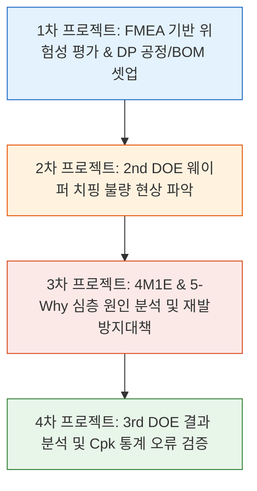

  <h1>📦 SATURN 프로젝트: 반도체 패키징 DP공정 기술 및 수율·품질 엔지니어링 실무</h1>
  <h3>BGA 패키징 DP(Lamination, Back Grinding, Sawing) 공정 셋업, FMEA 기반 위험성 평가, 4M1E/5-Why 치핑(Chipping) 불량 트러블슈팅 및 공정능력(Cpk) 양산성 검증</h3>
  

    
    
    
    
    
  

 

* **프로젝트 수행 기간:** 2026.08.24 ~ 2026.09.13 (렛유인 반도체 패키징 엔지니어링 실무)
본 프로젝트는 글로벌 스마트폰(A사)에 탑재되는 초박형 고성능 모바일 기기용 **254FBGA(Normal Single BGA)** 패키지인 **'SATURN 프로젝트'**의 성공적인 양산성 검증(Mass Qualification)을 목표로 수행된 **반도체 후공정(OSAT) 엔지니어링 실무 프로젝트**입니다.

반도체 전공정을 마친 12인치 웨이퍼(초기 두께 780㎛)를 수취하여, 칩을 절단하고 패키징 기판에 실장하기 직전 단계인 **DP(Die Preparation) 단위 공정(BG Tape Lamination → Back Grinding → Wafer Sawing)**을 중심으로 진행되었습니다. 
단순한 공정 파라미터 설정을 넘어, **FMEA(고장형태 및 영향분석)**를 통한 선제적 잠재 리스크 도출, **2차 DOE 중 발생한 웨이퍼 연속 치핑(Chipping) 불량의 4M1E 및 5-Why 기반 근본 원인 규명**, 그리고 **통계적 공정능력지수(Cpk) 데이터의 허점을 파헤친 비판적 엔지니어링 검증**까지 총 4단계에 걸쳐 체계적으로 완수했습니다.

---

## 🎯 패키지 및 웨이퍼 핵심 사양 (Device & PKG Specification)

| 구분 | 주요 파라미터 | 상세 스펙 (Engineering Data) | 비고 및 설계 특이사항 |
| :--- | :--- | :--- | :--- |
| **Package** | PKG Type / Dimension | **254FBGA** / 11.5 x 13.0 mm (두께 Max 1.0mm) | 와이어 본딩(Wire Bonding) 타입 디바이스 |
| | Mold Cap Thickness | 0.61T (1up) | 에폭시 몰딩 컴파운드(EMC) 보호층 |
| **Wafer / Die** | Wafer Size / Die Size | **12인치 (300mm)** / 9.916 x 2.080 mm | 직사각형 형태의 고밀도 다이 |
| | Wafer Initial / Target T | **780㎛ → 250㎛** (with Pattern Layer 10㎛) | 530㎛ 대량 연삭(Back Grinding) 필요 |
| | Scribe Line Width | **80㎛ (극도로 좁은 스크라이브 레인)** | 절단 여유폭이 적어 치핑 및 편심 위험 상존 |
| | DAF (Die Attach Film) | 두께 **20㎛** (FH-7221S(T)) | 다이와 DAF 테이프의 동시 절삭 필요 |
| **Substrate** | PCB Thickness / Matrix | 0.60 ± 0.015 mm / 7Row x 18Columns x 2Segment | AUS 308 PSR 도포, Ni Min 2㎛, Au Min 0.3㎛ |
| **Solder Ball** | Thickness (Diameter) | 0.21 mm | BGA 솔더볼 실장층 |

---

## 📑 프로젝트 단계별 수행 내용 (1차 ~ 4차)

---

### 1️⃣ 1차 프로젝트: FMEA 기반 공정 위험성 평가 및 DP 공정 조건·BOM 셋업
SATURN 제품의 신규 라인 셋업을 위해 공정별 잠재 고장 모드를 사전에 도출하고, BOM(원/부자재) 선정 및 CTQ(Critical to Quality) 품질 관리 기준을 수립했습니다.

#### 1. DP 단위 공정 조건 최적화 및 BOM 선정
* **BG Tape Lamination:** 범용(Universal) BG Tape인 `E-6142S` 선정 (Normal Wafer용). 커팅 각도 62°, 롤러 압력 0.5MPa, 롤러 속도 110mm/s, 블레이드 히터 온도 120℃로 표준화하여 기포(Tape Void) 및 이물 유입 방지.
* **Wafer Back Grinding:** 초기 780㎛ 웨이퍼를 250㎛까지 얇게 갈아내기 위해 2단계 연삭 진행.
  * 조연삭(Rough, G1): VC5 휠 적용, Wheel RPM 3200, Feed Rate 4→3→2 ㎛/s 다단계 감속 적용.
  * 정연삭(Fine, G2): VP1 휠 적용, Wheel RPM 3000, Feed Rate 0.4→0.3→0.2 ㎛/s로 표면 조도(Roughness ≤ 200nm) 및 TTV(평탄도 ≤ 10㎛) 충족.
* **Wafer Sawing (Step Cut):** 80㎛의 협폭 Scribe Line과 Si/DAF를 동시 절삭할 때 치핑을 방지하기 위해 2단계 Step Cut 적용.
  * Z1 Blade (Si Half Cut): `ZH05-SD3500-N1-50-CE` (Grit 미세화로 Si Top Chipping 억제, Kerf 폭 35~40㎛ 확보, 높이 0.080mm로 웨이퍼 잔여 80㎛ 유지).
  * Z2 Blade (DAF Full Cut): `ZH05-SD3500-N1-50-FD` (DAF 수지 레진 엉김/Clogging 방지 및 Bottom Chipping 억제, 테이프 절입 깊이 20~30㎛ 적용).

#### 2. FMEA 기반 전 공정 잠재 리스크 및 CTQ 검사 계획 수립
* **Lamination:** Tape Void(기포) 리스크 $\rightarrow$ Run by Run 전수 외관 검사.
* **Back Grinding:** Wafer Crack 및 TTV 불량 $\rightarrow$ 13-Point 두께 측정 및 5-Point 조도 측정.
* **Wafer Saw:** Top/Bottom Chipping 및 Kerf Shift(편심) $\rightarrow$ 채널당 2회(웨이퍼당 4회) 자동 Kerf Check, 10-Point 횡방향 크랙 및 절단폭 검사.
* **Wire Bonding & Mold:** 와이어 처짐(Sagging), 스티치 오픈, 몰드 플래시(I/M), 휨(Warpage) 방지를 위한 클램프 압력(17ton) 및 ULL(Ultra Low Loop) 콘셉트 수립.

---

### 2️⃣ 2차 프로젝트: 2차 DOE 웨이퍼 연속 치핑(Chipping) 불량 트러블슈팅 (현상 파악)
1차 DOE(2매) 평가 완료 후 동일 조건으로 진행된 2차 DOE(2매) Sawing 공정 중, **2번째 웨이퍼에서 자동 절단폭 검사 에러(Kerf Width Check Error Alarm)가 발생하며 설비가 셧다운(Hold)**되는 비상 상황이 발생했습니다.

#### 🚨 불량 현상 사실 검증 (Fact-Finding)
* **불량 현상:** 1번 웨이퍼 Ch1 영역의 절반 이후부터 2번 웨이퍼 Ch2 영역까지 **연속적인 다이 가장자리 깨짐(Chipping) 불량** 발생.
* **절단선 편심 확인:** 치핑이 발생한 다이를 광학 현미경으로 관찰한 결과, **절단선(Cut Line)이 스크라이브 레인 정중앙(Center)을 벗어나 위쪽 다이 패턴 방향으로 심하게 쏠려서(Kerf Shift) 잘린 사실**을 확인.
* **설비 H/W 및 블레이드 점검 결과 (정상):**
  * Z1/Z2 Saw Blade를 즉시 분리하여 현미경 검사 결과, 칼날의 휨(Bending), 마모, 치핑 파손 등 결함 일체 없음.
  * 치핑 미발생 영역 20-Point 샘플링 측정 결과 절단폭(Kerf Width)은 평균 42.4㎛(스펙 $\le 65$㎛)로 완벽한 정상 범위 유지.
  * **핵심 사실:** 설비 하드웨어(블레이드, 스핀들 진동, 척 테이블)의 물리적 결함은 불량 원인에서 완전히 배제됨.

---

### 3️⃣ 3차 프로젝트: 4M1E & 5-Why 심층 근본 원인 분석 및 재발방지대책(Fool-Proof) 수립

H/W 문제가 아님을 입증한 후, **4M1E (Man, Machine, Method, Material, Environment)** 프레임워크와 **5-Why 분석 기법**을 가동하여 인적 오류(Human Error)와 시스템적 허점을 파헤쳤습니다.

#### 🔍 4M1E 잠재 요인 분석 및 스크리닝
* **Material / Machine / Environment (배제):** 원자재(웨이퍼/테이프), 설비 진동/스핀들, 챔버 환경 모두 1차 DOE와 동일하며 정상. 수동으로 절단선을 정중앙(Center)으로 재정렬했을 때 치핑이 즉시 멈춤을 확인.
* **Man & Method (핵심 원인 도출):**
  * 1번 웨이퍼 Ch1 영역 가공 중 2번째 Kerf Check 시점에 작업자(Operator)가 화면 속 절단 위치가 불안정하다고 주관적으로 오판함.
  * **작업자가 임의로 Cut Position 좌표를 수동 조정(오보정)하여 칼날이 다이 패턴 쪽으로 틀어짐.**
  * 웨이퍼당 4회에 불과한 듬성듬성한 검사 주기와, 치핑이 발생함에도 설비가 자동으로 인터락을 걸지 못하는 시스템 부재로 인해 2번 웨이퍼까지 불량이 누적됨.

#### 🧠 5-Why 심층 인과관계 추적
1. **Why 1:** 왜 연속 치핑이 발생했는가? $\rightarrow$ Saw Blade가 정중앙을 벗어나 다이 패턴을 침범하며 절단됨.
2. **Why 2:** 왜 절단선이 한쪽으로 쏠렸는가? $\rightarrow$ 작업자가 2번째 Kerf Check 후 절단 위치를 수동으로 잘못 보정함.
3. **Why 3:** 왜 작업자가 위치를 잘못 보정했는가? $\rightarrow$ 화면 조명 난반사 및 비전 마스크 오인식으로 정상 범위를 불량으로 착각함.
4. **Why 4:** 왜 1차 웨이퍼 불량 시 멈추지 않고 2차까지 진행되었는가? $\rightarrow$ 긴 검사 주기와 치핑 감지 알람 인터락 부재.
5. **Why 5 (근본 원인):** **작업자의 임의 수동 수정을 원천 차단하는 설비 인터락 및 표준 작업 절차(SOP)가 미수립되었기 때문.**

#### 💡 개선 및 재발방지대책 (Fool-Proof System 구축)
* **단기 조치:** Cut Position Center 정밀 재정렬 검증 및 3차 DOE 투입 전 초품 런바이런(Run-by-Run) 10-Point 전수 모니터링.
* **장기 대책 (Fool-Proof 4대 체계):**
  1. **시스템 제어 (Recipe Parameter Locking):** 작업자가 임의로 절단 좌표를 변경할 수 없도록 설비 엔지니어 권한 잠금(Password Lock) 활성화.
  2. **비전 인식 최적화:** 다이 패턴 간섭을 차단하는 광학 마스크 영역 수정 및 챔버 조명 LED 표준화로 시인성 확보.
  3. **표준 작업 절차(SOP) 개정:** 화면 이상 발생 시 작업자 임의 조작을 전면 금지하고, 담당 엔지니어 확인 및 대면 승인(더블 체크) 의무화.
  4. **검사 주기 강화:** 가공 초기 이탈을 신속 감지하도록 초품 및 불안정 구간 검사 주기 단축.

---

### 4️⃣ 4차 프로젝트: 3차 DOE 결과 분석 및 Cpk(공정능력지수) 통계 오류 검증 (비판적 검증)

개선 대책을 적용한 후 3차 DOE를 진행하여 치핑이 완전히 해결되었음을 확인하고, 최종 DOE Report 데이터를 분석하는 과정에서 **현업 엔지니어가 놓칠 수 있는 2가지 중대한 통계/데이터 오류를 적발**했습니다.

#### 🚨 제공 데이터 내 중대 결함 적발 (Critical Error Finding)
1. **Back Grind 웨이퍼 두께 데이터 이상치(Outlier) 은폐 오류:**
   * **오류 사실:** 2차 평가 1st Wafer의 2번 측정 포인트 두께가 **`222㎛`**로 기재됨.
   * **부적합 이유:** SATURN 스펙은 $250 \pm 10$㎛ (240~260㎛)이므로 222㎛는 규격 하한을 심각하게 이탈한 **Spec-out(불량)**임.
   * **지적:** 동일 열 최소값(Min)에는 242.5㎛로 잘못 적혀 있었고 판정도 'Pass' 처리되어 있었음. 장비 헌팅이나 오타로 인한 이상치를 재측정하지 않고 그대로 통계에 포함해 Pass 처리한 것은 데이터 신뢰성을 훼손한 심각한 오류임을 입증.
2. **Saw 공정 Kerf Width의 공정능력지수(Cpk) 미달 오류:**
   * **오류 사실:** Kerf Width 실측 데이터가 1~3차 모두 상한 규격(Max 65㎛) 미만이라는 이유로 'Pass' 판정되어 있었으나, 산출된 **Cpk는 0.52 ~ 1.02**에 불과함.
   * **부적합 이유:** 반도체 양산 승인(Mass Qual) 기준 최소 요구 Cpk는 통상 **1.33 이상 (우수 공정 1.67 이상)**임.
   * **지적:** 평균 절단폭(61~62㎛)이 상한 규격(65㎛)에 너무 근접하여 공정 마진이 매우 부족함에도, 단순 실측값이 규격 안에 있다는 이유만으로 양산 승인(Pass)을 내리는 것은 엔지니어링 평가로 부적합함을 논리적으로 규명.

---

## 🛠️ 활용 공정 장비 및 분석 소프트웨어

* **공정 설비 (In-line Equipment):**
  * Lamination: `RU-3520` (웨이퍼 테이프 마운터)
  * Back Grinding: `DISCO DGP8761` (초정밀 웨이퍼 연삭기, VC5/VP1 다이아몬드 휠)
  * Wafer Sawing: `DISCO DFD6361` (듀얼 스핀들 다이싱 쏘, SD3500 블레이드)
  * Wire Bonding: K&S 초음파 열압착 와이어 본더 (ULL 루프 제어)
  * Molding: 자동 유압 트랜스퍼 몰딩기 (17ton 저압 클램핑)
* **계측 및 품질 분석 도구:**
  * Optical Microscope (고배율 광학 현미경, Kerf Width 측정)
  * SAT (초음파 탐상기, Scanning Acoustic Tomography) & X-Ray (내부 보이드/크랙 검사)
  * Contact Thickness Gauge (13-Point 웨이퍼 두께 및 TTV 평탄도 측정)
  * Statistical Process Control (Minitab 기반 정규분포 및 Cpk 산출)

---

## 💡 최종 결론 및 엔지니어링 역량 (Conclusion)

본 SATURN 프로젝트를 통해 반도체 후공정(OSAT) 양산 라인에서 요구되는 핵심 엔지니어링 역량을 증명했습니다.
1. **공정 셋업 및 위험 관리:** FMEA를 통해 웨이퍼 박형화(780㎛ $\rightarrow$ 250㎛)와 협폭 스크라이브 레인(80㎛)의 물리적 한계를 선제적으로 방어하는 공정 조건을 수립했습니다.
2. **논리적 불량 추적력:** 2차 DOE 치핑 발생 시, 막연한 추측이 아닌 H/W 점검 $\rightarrow$ 4M1E 인과관계 스크리닝 $\rightarrow$ 5-Why 분석을 통해 '작업자 임의 수동 보정'이라는 인적 오류를 정확히 짚어냈습니다.
3. **Fool-Proof 시스템 구축:** 작업자의 선의나 주의력에 의존하지 않고, 레시피 잠금(Recipe Locking)과 표준 작업 지침(SOP) 개정을 통해 사람이 실수하고 싶어도 할 수 없도록 구조화했습니다.
4. **비판적 데이터 검증:** 단순 합격 판정에 안주하지 않고, 222㎛ 이상치와 Cpk 1.33 미달 문제를 통계적으로 파헤쳐 양산 리스크를 선제적으로 차단하는 진정한 수율/공정 엔지니어의 자질을 입증했습니다.